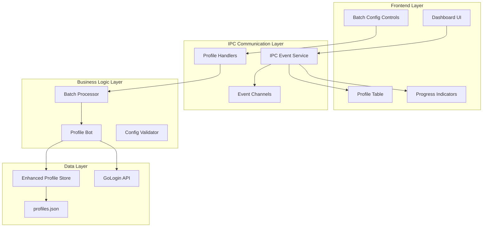
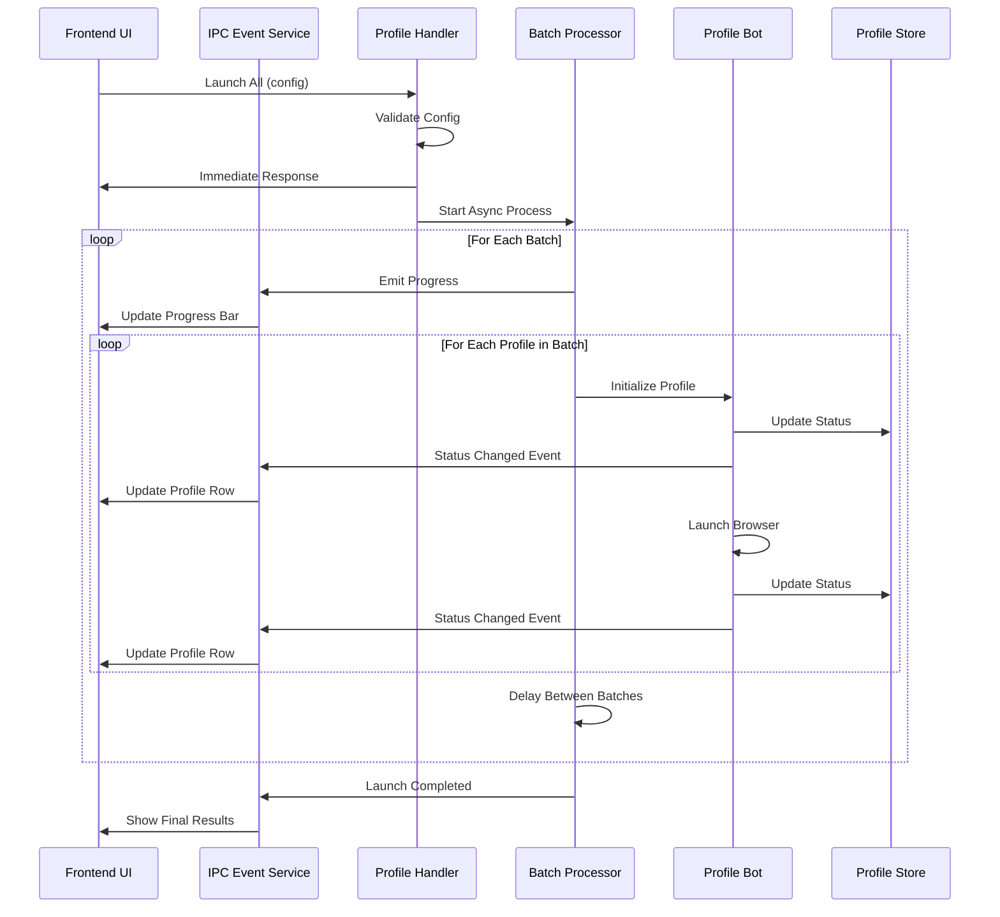
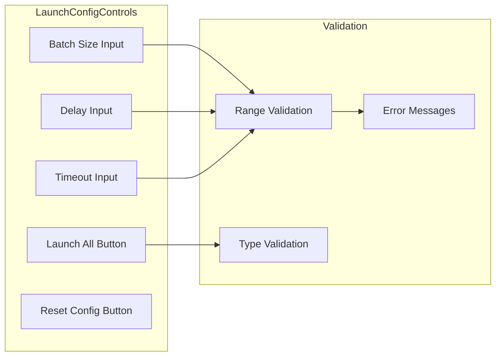
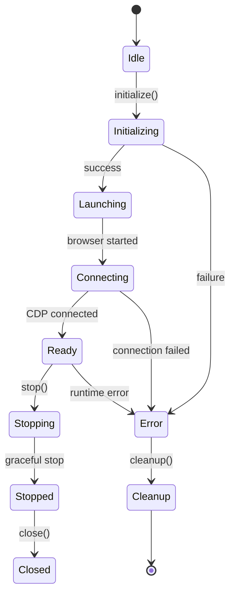
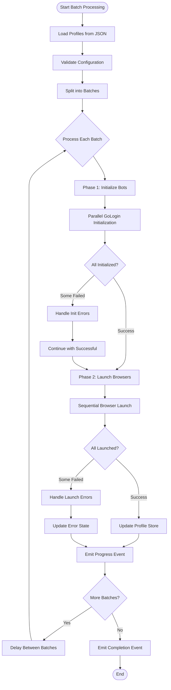
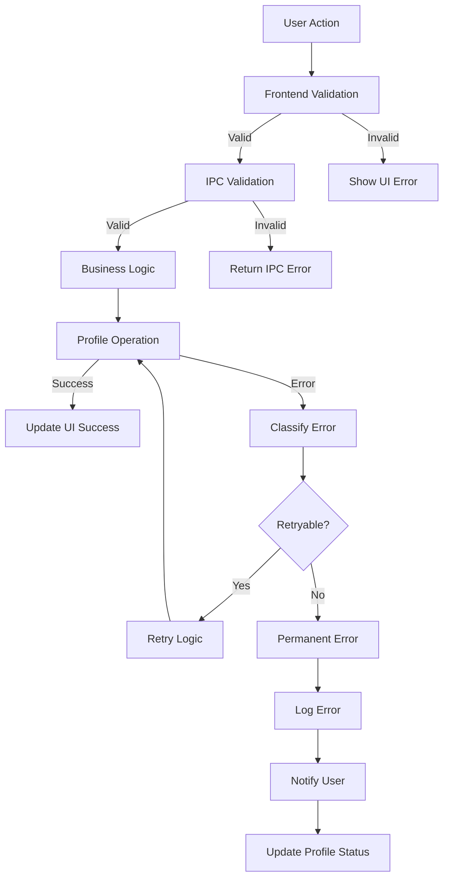

# Profile Management System Enhancement

## Overview

The Profile Management System Enhancement focuses on implementing a robust, scalable batch processing system for GoLogin profiles with real-time status updates, dynamic configuration, and comprehensive error handling. This enhancement transforms the current single-profile operations into a sophisticated multi-profile management system.

**Key Goals:**
- Implement dynamic batch processing with configurable parameters
- Add real-time status tracking and progress monitoring
- Create centralized IPC event management
- Enhance error handling and recovery mechanisms
- Improve user experience with responsive UI controls

## Technology Stack & Dependencies

**Core Technologies:**
- Electron 37.2.3 (Main process architecture)
- React 19.1.0 (Renderer UI components)
- Node.js (Backend services)
- GoLogin API integration

**Development Patterns:**
- IPC communication for process isolation
- Promise-based asynchronous operations
- Event-driven architecture for real-time updates
- Map-based profile storage for O(1) access

## Architecture

### System Overview



### Enhanced IPC Event Architecture

**Event-Driven Communication Pattern:**
- Centralized IPC Event Service for consistent messaging
- Typed event channels for type safety
- Real-time status updates with structured data
- Progress tracking with batch information



## Component Architecture

### 1. Enhanced IPC Event Channels

**New Event Channels:**
```typescript
interface IPCEventChannels {
  PROFILES_FETCHED: 'event:profiles-fetched'
  PROFILE_STATUS_CHANGED: 'event:profile-status-changed'
  PROFILE_ERROR: 'event:profile-error'
  LAUNCH_ALL_PROGRESS: 'event:launch-all-progress'
  LAUNCH_ALL_COMPLETED: 'event:launch-all-completed'
  BATCH_STARTED: 'event:batch-started'
  BATCH_COMPLETED: 'event:batch-completed'
}
```

**Event Data Structures:**
```typescript
interface ProfileStatusEvent {
  profileId: string
  status: ProfileStatus
  message: string
  phase?: string
  timestamp: string
}

interface LaunchProgressEvent {
  current: number
  total: number
  launched: number
  errors: number
  currentBatch: string[]
  batchNumber: number
  estimatedTimeRemaining?: number
  timestamp: string
}
```

### 2. Dynamic Frontend Configuration Controls

**Batch Configuration Component:**


**Configuration Schema:**
```typescript
interface LaunchConfiguration {
  batchSize: number        // 1-20, default: 10
  delayBetweenBatches: number  // ≥1000ms, default: 2000
  timeoutPerProfile: number    // ≥10000ms, default: 30000
  retryFailedProfiles: boolean // default: false
  cleanupOnFailure: boolean    // default: true
  concurrentBrowsers: number   // 1-5, default: 3
}
```

### 3. Profile Bot Class Architecture

**Simplified Profile Operations Focus:**
```typescript
class ProfileBot {
  // Core Properties
  profile: EnhancedProfile
  gologinInstance: GoLogin | null
  browser: Browser | null
  cdpClient: Page | null
  status: ProfileStatus
  
  // Lifecycle Methods
  async initialize(): Promise<void>
  async launch(): Promise<void>
  async stop(): Promise<void>
  async close(): Promise<void>
  async cleanup(): Promise<void>
  
  // Utility Methods
  parseProxy(proxyString: string): ProxyConfig
  validateProfileData(): boolean
  getResourceUsage(): ResourceMetrics
}
```

**Status Flow Management:**


### 4. Centralized IPC Event Service

**Service Architecture:**
```typescript
class IPCEventService {
  private mainWindow: BrowserWindow | null
  
  // Core Event Emission
  emitProfilesFetched(profiles: Profile[]): void
  emitProfileStatusChanged(event: ProfileStatusEvent): void
  emitProfileError(event: ProfileErrorEvent): void
  emitLaunchProgress(event: LaunchProgressEvent): void
  emitLaunchCompleted(event: LaunchCompletedEvent): void
  
  // Batch-Specific Events
  emitBatchStarted(batchInfo: BatchInfo): void
  emitBatchCompleted(batchResults: BatchResults): void
  
  // Utility Methods
  setMainWindow(window: BrowserWindow): void
  validateEventData(eventType: string, data: any): boolean
}
```

### 5. Enhanced Batch Processing Engine

**Two-Phase Processing Strategy:**

**Phase 1: Initialization**
- Parallel GoLogin instance creation
- Profile validation and sanitization
- Resource allocation and conflict detection
- Early failure detection and reporting

**Phase 2: Browser Launch**
- Sequential browser startup (resource management)
- CDP connection establishment
- Profile store registration
- Status broadcasting



## Data Models & ORM Mapping

### Enhanced Profile Schema

```typescript
interface EnhancedProfile {
  // Core Profile Data
  id: string
  name: string
  supporterId: string
  expiry: string
  cvv: string
  seats: number
  url: string
  proxy: string
  priority: number
  
  // Authentication State
  loginState: 'Logged Out' | 'Logged In' | 'Session Expired'
  password: string
  
  // Personal Information
  personalInfo: {
    firstName: string
    lastName: string
    email: string
    postalCode: string
    pr: string
  }
  
  // Payment Information
  cardInfo: {
    number: string
    type: string
    expiry: string
    cvv: string
  }
  
  // Event Configuration
  eventInfo: {
    eventId: string
    matchUrl: string
    ticketLimit: number
    token: string
  }
  
  // Scraping Configuration
  scrapingConfig: {
    targetTickets: number
    maxRetries: number
    delayBetweenActions: number
    randomBrowsingPages: string[]
    autoLogin: boolean
    handleCaptcha: 'auto' | 'manual'
  }
  
  // Runtime State
  status: ProfileStatus
  scrapingState: 'idle' | 'running' | 'paused' | 'stopped'
  operationalState: 'idle' | 'active' | 'error' | 'stopping'
  currentPage: string
  retryCount: number
  ticketCount: number
  
  // Browser Instances (Runtime Only)
  gologin?: GoLogin
  browser?: Browser
  cdp?: Page
  
  // Timestamps
  launchedAt?: string
  stoppedAt?: string
  lastActivity: string
  
  // Error Tracking
  errorMessage?: string
  errorPhase?: string
}
```

### Configuration Object Structure

```typescript
interface SystemConfiguration {
  // Batch Processing
  batchProcessing: {
    defaultBatchSize: number
    maxBatchSize: number
    minDelayBetweenBatches: number
    defaultDelayBetweenBatches: number
    maxConcurrentBrowsers: number
  }
  
  // Timeouts and Retries
  timeouts: {
    profileInitialization: number
    browserLaunch: number
    cdpConnection: number
    operationTimeout: number
  }
  
  // Error Handling
  errorHandling: {
    retryAttempts: number
    retryDelay: number
    cleanupOnFailure: boolean
    continueOnError: boolean
  }
  
  // Resource Management
  resources: {
    memoryThreshold: number
    cpuThreshold: number
    cleanupInterval: number
    maxIdleTime: number
  }
}
```

## Business Logic Layer

### Validation Strategy

**Multi-Layer Validation Pattern:**

1. **Input Validation** (Frontend)
   - Type checking and range validation
   - User input sanitization
   - Real-time feedback

2. **Configuration Validation** (IPC Layer)
   - Payload structure validation
   - Business rule enforcement
   - Security constraints

3. **Profile Validation** (Business Layer)
   - Profile data integrity
   - Resource availability
   - Operational constraints

```typescript
interface ValidationResult<T> {
  isValid: boolean
  sanitizedData?: T
  errors: ValidationError[]
  warnings: ValidationWarning[]
}

interface ValidationError {
  field: string
  message: string
  severity: 'error' | 'warning'
  code: string
}
```

### Error Handling Strategy

**Hierarchical Error Management:**



**Error Classification System:**
```typescript
enum ErrorType {
  VALIDATION_ERROR = 'validation',
  NETWORK_ERROR = 'network',
  AUTHENTICATION_ERROR = 'authentication',
  RESOURCE_ERROR = 'resource',
  TIMEOUT_ERROR = 'timeout',
  UNKNOWN_ERROR = 'unknown'
}

interface ClassifiedError {
  type: ErrorType
  severity: 'low' | 'medium' | 'high' | 'critical'
  retryable: boolean
  userMessage: string
  technicalMessage: string
  suggestedAction?: string
}
```

## State Management Strategy

### Profile Store Enhancement

**Enhanced Storage Architecture:**
```typescript
class EnhancedProfileStore {
  private profiles: Map<string, EnhancedProfile>
  private instances: Map<string, BrowserInstances>
  private metadata: Map<string, ProfileMetadata>
  
  // Core Operations
  setProfile(profile: EnhancedProfile): void
  getProfile(id: string): EnhancedProfile | undefined
  updateProfile(id: string, updates: Partial<EnhancedProfile>): void
  removeProfile(id: string): void
  
  // Instance Management
  setInstances(id: string, instances: BrowserInstances): void
  getInstances(id: string): BrowserInstances | undefined
  clearInstances(id: string): void
  
  // Batch Operations
  getProfilesByStatus(status: ProfileStatus): EnhancedProfile[]
  updateMultipleProfiles(updates: ProfileUpdate[]): BatchResult
  
  // Memory Management
  cleanup(): void
  getMemoryUsage(): MemoryMetrics
}
```

### Real-Time Status Synchronization

**Event Synchronization Pattern:**
- Profile Store updates trigger IPC events
- UI components subscribe to relevant events
- Optimistic updates with error rollback
- Conflict resolution for concurrent updates

## Testing Strategy

### Unit Testing Approach

**Test Coverage Areas:**
1. **Configuration Validation**
   - Input validation functions
   - Range and type checking
   - Error message generation

2. **Profile Bot Operations**
   - Initialization sequences
   - Error handling scenarios
   - Resource cleanup

3. **Batch Processing Logic**
   - Batch creation and execution
   - Progress tracking accuracy
   - Error aggregation

4. **IPC Event System**
   - Event emission and reception
   - Data structure validation
   - Error propagation

**Mock Strategy:**
```typescript
// GoLogin API Mocking
const mockGoLogin = {
  start: jest.fn().mockResolvedValue({ wsEndpoint: 'ws://localhost:9222' }),
  stop: jest.fn().mockResolvedValue(true)
}

// Browser Instance Mocking
const mockBrowser = {
  newPage: jest.fn().mockResolvedValue(mockPage),
  close: jest.fn().mockResolvedValue(true)
}

// IPC Event Mocking
const mockIPCEventService = {
  emitProfileStatusChanged: jest.fn(),
  emitLaunchProgress: jest.fn()
}
```

## Implementation Phases

### Phase 1: Foundation Infrastructure (Days 1-3)
**Objectives:** Establish core architecture and communication patterns

**Tasks:**
- Implement IPC Event Service with centralized messaging
- Add dynamic configuration controls to frontend
- Create enhanced validation functions
- Set up event channel definitions

**Deliverables:**
- Functional IPC Event Service
- Frontend batch configuration component
- Validation utility functions
- Updated IPC channel definitions

### Phase 2: Profile Bot Development (Days 4-6)
**Objectives:** Create robust profile management core

**Tasks:**
- Implement simplified ProfileBot class
- Add lifecycle management methods
- Integrate GoLogin API interactions
- Implement status tracking

**Deliverables:**
- ProfileBot class with full lifecycle support
- GoLogin integration module
- Status flow management
- Error handling for profile operations

### Phase 3: Batch Processing Engine (Days 7-10)
**Objectives:** Implement sophisticated batch processing

**Tasks:**
- Create two-phase batch processor
- Implement dynamic configuration handling
- Add progress tracking and reporting
- Integrate with Profile Bot instances

**Deliverables:**
- Functional batch processing engine
- Progress monitoring system
- Dynamic configuration support
- Error aggregation and reporting

### Phase 4: Integration & Enhancement (Days 11-14)
**Objectives:** Complete system integration and optimization

**Tasks:**
- Enhance Profile Store with complete data management
- Implement comprehensive error handling
- Add performance monitoring
- Optimize resource management

**Deliverables:**
- Enhanced Profile Store with full features
- Complete error handling system
- Performance monitoring tools
- Resource optimization features

### Phase 5: Testing & Refinement (Days 15-16)
**Objectives:** Ensure system reliability and performance

**Tasks:**
- Comprehensive unit testing
- Integration testing scenarios
- Performance benchmarking
- Documentation completion

**Deliverables:**
- Full test suite
- Performance benchmarks
- Complete documentation
- System ready for production