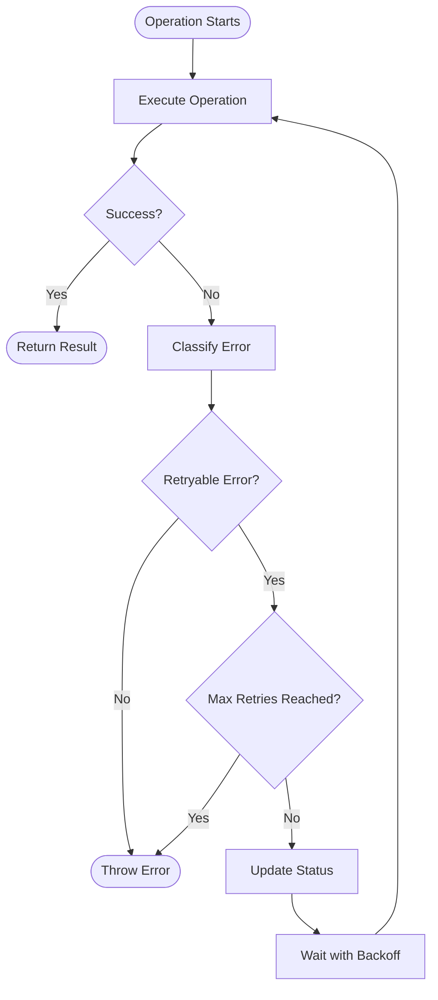

# Retry Mechanism for Internet-Related Failures

## Overview

This implementation adds robust retry functionality to the login system to handle internet-related failures gracefully. The system uses exponential backoff with smart error classification to retry only appropriate failures.

## Components

### 1. RetryService (`src/main/utils/retry-service.js`)

A centralized utility class that provides retry logic with the following features:

- **Exponential Backoff**: Delays start at 5 seconds and increase up to 15 seconds
- **Smart Error Classification**: Only retries network/internet-related errors
- **Configurable Parameters**: Customizable retry counts and delays
- **Status Callbacks**: Support for UI status updates during retries

#### Key Methods:

```javascript
// Execute operation with retry
await retryService.executeWithRetry(
  operation,           // Function to execute
  config,             // Retry configuration
  profileId,          // For logging
  operationName,      // For logging
  onRetry             // Status callback
)

// Check if error is retryable
retryService.isRetryableError(error)

// Create custom configuration
retryService.createRetryConfig({ maxRetries: 5 })
```

### 2. Enhanced Status Constants (`src/shared/status-constants.js`)

Added new status constants for retry operations:

- `PROFILE_STATUSES.RETRYING_LOGIN`
- `PROFILE_STATUSES.RETRYING_NAVIGATION`
- `PROFILE_STATUSES.RETRYING_CONNECTION`
- `LOGIN_STATUSES.RETRYING_LOGIN`

### 3. Enhanced Login Method (`src/main/services/profile/singleProfileTicketBot.js`)

The login method now includes:

- Automatic retry for network failures
- Real-time status updates during retries
- Proper error classification
- User-friendly retry messages

## Error Classification

### Retryable Errors (Will be retried):
- Network connectivity issues: `timeout`, `connection`, `ECONNREFUSED`
- DNS problems: `getaddrinfo`, `name_not_resolved`
- CDP/WebSocket issues: `websocket`, `browser disconnected`
- Navigation failures: `navigation timeout`, `page load timeout`

### Non-Retryable Errors (Will NOT be retried):
- Authentication failures: `invalid credentials`, `unauthorized`
- Validation errors: `validation`, `invalid input`
- User interaction required: `captcha`, `manual intervention`
- Authorization issues: `forbidden`, `not found`

## Configuration

### Default Settings:
```javascript
{
  maxRetries: 3,        // Maximum retry attempts
  minDelay: 5000,       // 5 seconds minimum delay
  maxDelay: 15000,      // 15 seconds maximum delay
  backoffFactor: 1.5    // Exponential backoff multiplier
}
```

### Custom Configuration:
```javascript
const customConfig = retryService.createRetryConfig({
  maxRetries: 5,
  minDelay: 3000,
  maxDelay: 20000
})
```

## Usage Examples

### Basic Retry:
```javascript
const result = await retryService.executeWithRetry(
  async () => {
    // Your operation here
    return await someNetworkOperation()
  },
  { maxRetries: 3 },
  profileId,
  'network-operation'
)
```

### With Status Updates:
```javascript
const result = await retryService.executeWithRetry(
  loginOperation,
  retryConfig,
  profileId,
  'login',
  (attempt, maxRetries, delay) => {
    // Update UI status
    this.updateStatus(
      PROFILE_STATUSES.RETRYING_LOGIN, 
      `Retry ${attempt}/${maxRetries} - waiting ${delay/1000}s`
    )
  }
)
```

## Status Updates During Retries

The system provides real-time feedback to users:

1. **Initial Attempt**: `\"Attempting login\"`
2. **First Retry**: `\"Retry 1/3 - waiting 5s\"`
3. **Second Retry**: `\"Retry 2/3 - waiting 7s\"`
4. **Third Retry**: `\"Retry 3/3 - waiting 11s\"`
5. **Success**: `\"Login successful\"`
6. **Final Failure**: `\"Network error - retries exhausted\"`

## Testing

Use the test utility to validate the retry mechanism:

```javascript
import { retryTestUtility } from './retry-test-utility.js'

// Run all tests
await retryTestUtility.runTests()

// Test error classification
retryTestUtility.testErrorClassification()
```

## Integration Points

### Current Integration:
- ✅ Login operations in `SingleProfileTicketBot`
- ✅ Status updates and user feedback
- ✅ Error classification and handling

### Future Extensions:
- Navigation operations
- GoLogin connection establishment
- CDP connection retries
- Scraping operations
- API calls

## Benefits

1. **Improved Reliability**: Handles transient network issues automatically
2. **Better User Experience**: Clear status updates during retries
3. **Smart Retry Logic**: Only retries appropriate errors
4. **Configurable**: Easy to adjust retry parameters
5. **Extensible**: Can be used for other operations
6. **Maintainable**: Centralized retry logic

## Error Handling Flow



## Monitoring and Logging

The retry system provides comprehensive logging:

- Initial operation attempts
- Retry attempt notifications
- Error classification decisions
- Backoff delay calculations
- Success/failure outcomes
- User status updates

All logs include the profile ID for easy tracking and debugging.

## Security Considerations

- Retry delays prevent overwhelming target servers
- Authentication errors are never retried
- Captcha requirements halt retries appropriately
- Maximum retry limits prevent infinite loops
- Exponential backoff prevents aggressive retry patterns

---

**Note**: This implementation follows the project specifications for 5-15 second delays, smart error classification, and maximum 3-5 retry attempts. The system is designed to be reliable, user-friendly, and maintainable.